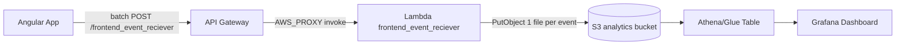
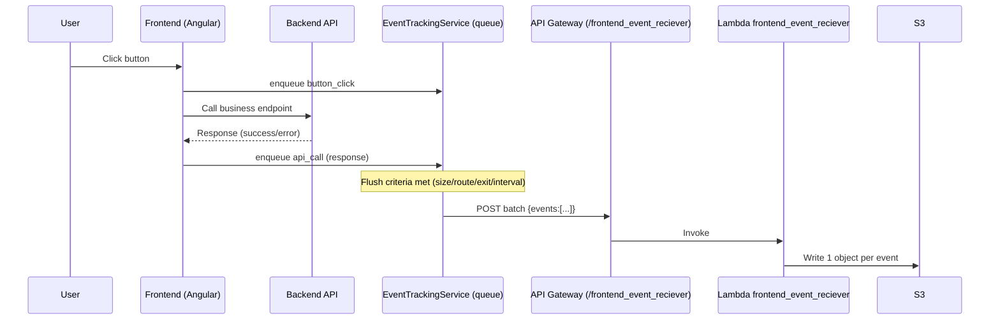

# event_recorder_analytics (Consolidated)

This document consolidates the full analytics event recording feature across:
- Frontend (Angular): `../veet-code-app/veet-app`
- Backend (Go Lambda): `./lc_statistics/cognito_dynamo/frontend_event_reciever`
- Infra (Terraform): `../veet-code-infra`

Baseline date: 2026-02-15.

## Feature Summary

Goal:
- Capture frontend usage and API execution telemetry.
- Enforce a consistent event model (UI events are not API events).
- Persist query-friendly records in S3 for Athena/QuickSight/Grafana.

Endpoint (dev):
- `POST https://29nac9o231.execute-api.sa-east-1.amazonaws.com/dev/frontend_event_reciever`

High-level flow:
1. Frontend emits analytics events.
2. Frontend sends a batch payload to API Gateway.
3. API Gateway invokes Lambda `frontend_event_reciever` (AWS_PROXY).
4. Lambda validates and persists one S3 object per event.

## Diagrams

### Architecture



### S3 Partitioning

```mermaid
flowchart TD
  P[analytics-events/] --> D[anomesdia=YYYYMMDD/]
  D --> A[app=veet-app-web/]
  A --> T[eventType=page_access|button_click|api_call/]
  T --> F[eventId.json]
```

### Event Emission (User Click + API)

Rule of thumb: a user click that triggers an API call produces 2 events.



## Event Model (Semantics)

`eventType` values:
- `page_access`: user entered/opened a page
- `button_click`: user clicked a button
- `api_call`: frontend executed an API request (success/error)

Rule of thumb:
- If a user click triggers an API request, send 2 events:
  - `button_click` (no `api`)
  - `api_call` (with `api`)

## Event Contract

Required fields in each event:
- `eventId`
- `timestamp` (RFC3339)
- `app`
- `eventType`
- `phase` (`start` or `response`)
- `source` (`page_load` or `user_click`)
- `feature`
- `page`

Optional fields:
- `label`
- `metadata` (free-form object)
- `user.sub`, `user.email`

API object rules:
- `eventType=api_call`:
  - `api` is required
- `eventType=button_click`:
  - `api` must not be present
- `eventType=page_access`:
  - `api` is temporarily accepted for migration compatibility

If `api` is present:
- required: `api.name`, `api.endpoint`, `api.method`
- `api.method` allowed: `GET`, `POST`, `PUT`, `DELETE`
- optional: `api.statusCode`
- optional: `api.outcome` (`success`, `error`)

## Frontend (Angular)

Repo:
- `../veet-code-app/veet-app`

Key files:
- `src/app/analytics/analytics-capture.service.ts` (single entrypoint for capturing events)
- `src/app/analytics/event-tracking.service.ts`
- `src/app/analytics/api-events.interceptor.ts`
- `src/app/questions/questions-page/questions-page.component.ts`
- `src/environments/environment.ts`

Config:
- `environment.analyticsEventsApiUrl` must point to `/frontend_event_reciever`.

### How To Emit Events (Single Entry Point)

Rule: components/interceptors should call **only**:
- `AnalyticsCaptureService.capture(...)`

`EventTrackingService` is an internal detail responsible for:
- queueing
- batching/flush criteria
- sending the HTTP request to the analytics endpoint

#### Page Access

Call once when a page/view is loaded (example pattern):

```ts
constructor(private readonly analyticsCapture: AnalyticsCaptureService) {}

ngOnInit(): void {
  this.analyticsCapture.capture({ type: 'page_access' });
}
```

#### Button Click

Emit a `button_click` for every real user click.

Recommended patterns:
1. If you have the click event: pass the button element so the service derives label + metadata:

```ts
onClick(event: MouseEvent): void {
  const el = (event.target as HTMLElement | null)?.closest('button, [role="button"]') as HTMLElement | null;
  this.analyticsCapture.capture({ type: 'button_click', element: el });
}
```

2. If you already know the label (simpler, less DOM-dependent):

```ts
this.analyticsCapture.capture({ type: 'button_click', buttonLabel: 'Submit Feedback' });
```

Notes:
- If you use delegated click capture (like `QuestionsPageComponent`), make clickable elements real `<button>`s (or include `role="button"`) so they’re discoverable via `.closest(...)`.
- Don’t double-capture: either rely on the delegated listener or call `capture(...)` directly in the button handler, not both.

#### API Call (Success/Error)

Emit one `api_call` per API response:
- `outcome=success` when you receive an `HttpResponse`
- `outcome=error` when you receive an `HttpErrorResponse`

Two ways to instrument API calls:
1. Automatic for most endpoints: `ApiEventsInterceptor`
- This produces `api_call` events with `source: page_load` (current implementation).

2. Manual for user-click driven endpoints (recommended for correct `source=user_click`)
- Add the endpoint path to `ApiEventsInterceptor.manuallyTrackedEndpoints` to avoid double counting.
- Call `capture({ type: 'api_call', ... source: 'user_click', label: '<button label>' })` in the click flow.

Example:

```ts
this.analyticsCapture.capture({
  type: 'api_call',
  apiName: 'create_exercise',
  apiMethod: 'POST',
  apiEndpoint: '/create_exercise',
  statusCode: response.status,
  outcome: 'success',
  source: 'user_click',
  label: 'Add Question'
});
```

### What the Frontend Sends (Batch)

Frontend sends batched requests to the endpoint.

Batch payload shape:
```json
{
  "batchId": "uuid",
  "sentAt": "2026-02-15T03:40:00.000Z",
  "reason": "max_batch_size | interval_10s | route_change | pagehide | hidden",
  "app": "veet-app-web",
  "events": [ { "eventId": "...", "timestamp": "...", "app": "...", "eventType": "...", "phase": "...", "source": "...", "feature": "...", "page": "..." } ]
}
```

### Flush Criteria (When the Frontend Calls the Endpoint)

Current behavior is batch-only.

The endpoint is called only when criteria are met:
- queue reaches 4 events (`max_batch_size`)
- Angular route change (`route_change`)
- page/tab exit (`pagehide` or `hidden`)
- periodic check every 10s (`interval_10s`) but only if queue is non-empty

If 10s passes and there are no queued events:
- frontend logs: `[EventTracking] 10s check: no new events to flush`
- no API call is made

### Avoiding False button_click on Page Load

The questions page click listener ignores synthetic/non-user clicks:
- `src/app/questions/questions-page/questions-page.component.ts` checks `event.isTrusted`

## Backend (Go Lambda)

Repo:
- this repo (`veet-code-go`)

Lambda path:
- `lc_statistics/cognito_dynamo/frontend_event_reciever`

Key files:
- `packages/handler/handler.go` (batch + single request parsing, orchestration)
- `packages/handler/validation.go` (contract and semantic rules)
- `packages/storage/s3.go` (S3 persistence)

### Accepted Request Formats

The Lambda accepts:
- Batch payloads (preferred): `{"events": [...]}`
- Single event payloads (backward compatible)

Batch handling:
- Validates every event.
- Rejects entire batch on the first invalid event (400) with `eventId` + details.
- Dedupe is per eventId (S3 key existence).

### Response

Single event:
- 202 with `{ "eventId": "...", "status": "accepted" }`
- duplicates return `{ "status": "already_processed" }`

Batch:
- 202 with `{ "status": "accepted", "batchId": "...", "accepted": <n>, "already_processed": <m> }`

### Storage

Bucket:
- env var `events_bucket_name` (fallback `EVENTS_BUCKET`)

Object key format:
- `analytics-events/anomesdia=YYYYMMDD/app=<app>/eventType=<eventType>/<eventId>.json`

Persisted JSON is flattened:
- includes `ingestionTimestamp`
- does not include a `raw` copy of the original payload

## Grafana Dashboard (Athena Datasource)

This is the current recommended approach to visualize events without QuickSight:
- Athena reads the S3 JSON partitions.
- Grafana OSS queries Athena via the Athena datasource plugin.

### Create Athena Database + Table

Run in Athena (adjust bucket name):

```sql
CREATE DATABASE IF NOT EXISTS frontend_events;

CREATE EXTERNAL TABLE IF NOT EXISTS frontend_events.analytics_events (
  eventid string,
  eventtimestamp string,
  ingestiontimestamp string,
  phase string,
  source string,
  feature string,
  page string,
  label string,
  usersub string,
  useremail string,
  apiname string,
  apiendpoint string,
  apimethod string,
  apistatuscode int,
  apioutcome string
)
PARTITIONED BY (
  anomesdia string,
  app string,
  eventtype string
)
ROW FORMAT SERDE 'org.openx.data.jsonserde.JsonSerDe'
LOCATION 's3://veet-code-frontend-events-<ACCOUNT_ID>/analytics-events/';
```

Load partitions:

```sql
MSCK REPAIR TABLE frontend_events.analytics_events;
```

### Local Grafana (Docker)

Start Grafana with the Athena plugin:

```yaml
services:
  grafana:
    image: grafana/grafana-oss:latest
    ports:
      - "3000:3000"
    environment:
      - GF_INSTALL_PLUGINS=grafana-athena-datasource
      - AWS_REGION=sa-east-1
      - AWS_ACCESS_KEY_ID=${AWS_ACCESS_KEY_ID}
      - AWS_SECRET_ACCESS_KEY=${AWS_SECRET_ACCESS_KEY}
    volumes:
      - ./grafana/provisioning:/etc/grafana/provisioning
```

Provision the datasource (`grafana/provisioning/datasources/athena.yaml`):

```yaml
apiVersion: 1
datasources:
  - name: Athena
    type: grafana-athena-datasource
    access: proxy
    jsonData:
      defaultRegion: sa-east-1
      catalog: AwsDataCatalog
      database: frontend_events
      workgroup: primary
      outputLocation: s3://aws-athena-query-results-<ACCOUNT_ID>-sa-east-1/
    secureJsonData: {}
```

### Starter Panels (SQL)

Events per day:

```sql
SELECT anomesdia, count(*) AS events
FROM analytics_events
GROUP BY 1
ORDER BY 1;
```

Event type split:

```sql
SELECT eventtype, count(*) AS total
FROM analytics_events
GROUP BY 1
ORDER BY 2 DESC;
```

API success vs error:

```sql
SELECT apiname, apioutcome, count(*) total
FROM analytics_events
WHERE eventtype = 'api_call'
GROUP BY 1, 2
ORDER BY 3 DESC;
```

Top pages:

```sql
SELECT page, count(*) total
FROM analytics_events
WHERE eventtype = 'page_access'
GROUP BY 1
ORDER BY 2 DESC
LIMIT 20;
```

### Suggested Dashboard Layout (Panels)

Recommended dashboard name: `Frontend Analytics (Events)`

Panels:
- Events (time series): total events grouped by day (`anomesdia`)
- Event Types (bar): count grouped by `eventtype`
- Top Pages (table): `page_access` by `page`
- Top Buttons (table): `button_click` by `label` (or `feature`)
- API Calls (table): `api_call` grouped by `apiname` and `apioutcome`

Useful dashboard variables (Grafana):
- `app` (partition)
- `eventtype` (partition)
- `anomesdia` (partition)
- `source` (column filter)

## Infra (Terraform)

Repo:
- `../veet-code-infra`

Key files:
- `frontend_event_reciever.tf` (S3 bucket + Lambda module + env vars + integration module)
- `apigateway_integrations/frontend_event_reciever/main.tf` (API Gateway resource/methods/integration)
- `outputs.tf` (endpoint + bucket outputs)
- `README.md` (infra overview for this feature)

Terraform outputs:
- `frontend_event_reciever_endpoint`
- `frontend_event_reciever_events_bucket`

## Troubleshooting

Symptom: endpoint returns business payload (example `metric_id`)
- Likely wrong Lambda artifact or wrong API Gateway integration.
- Confirm infra artifact path:
  - `../veet-code-infra/lambdas/frontend_event_reciever/frontend_event_reciever.zip`

Symptom: CORS failures
- Ensure `ALLOWED_ORIGINS` is `*` or includes your origin.

Symptom: 400 about api object
- `button_click` must not include `api`.
- For API telemetry, emit separate `api_call` event.
